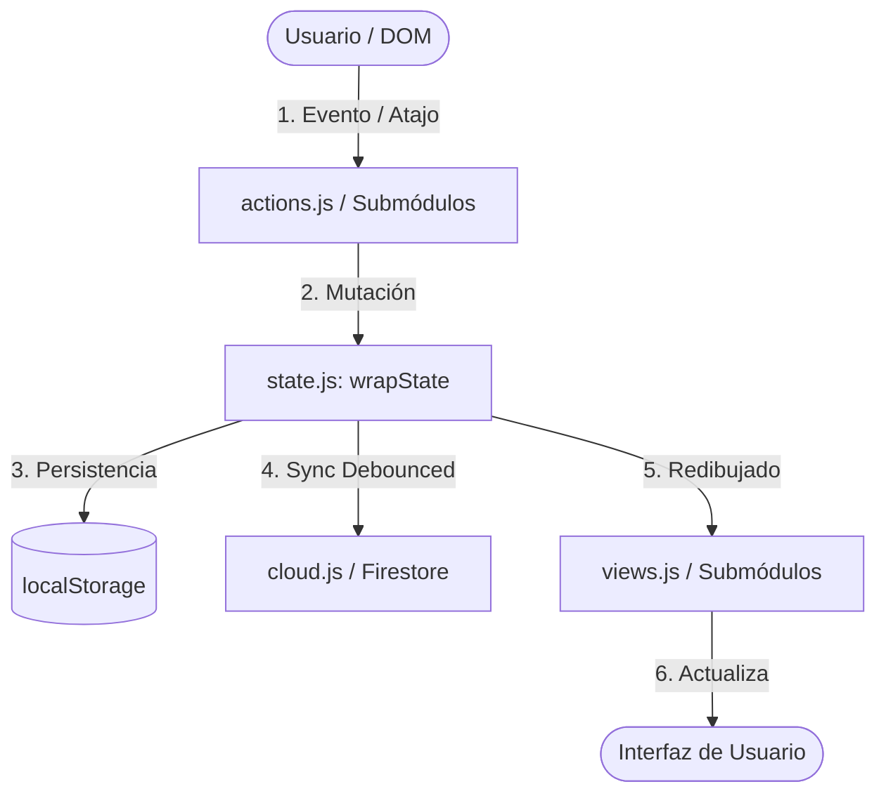

# Arquitectura del Proyecto (TodayTasks)

Este documento describe la arquitectura técnica, la estructura modular, los patrones de diseño y el flujo de datos de **TodayTasks**. Su propósito es servir de referencia para desarrolladores y agentes de IA que contribuyan al repositorio.

---

## 1. Visión General y Paradigma

* **Tipo de Aplicación:** Single Page Application (SPA) para la gestión diaria de tareas, reuniones, interrupciones y planificación temporal.
* **Stack Tecnológico:**
  * **Lenguaje:** JavaScript Vanilla nativo con **ES Modules** (`type="module"`).
  * **Sin Bundlers:** No utiliza Webpack, Vite, Rollup ni Babel en tiempo de ejecución. Los archivos `.js` se sirven directamente al navegador.
  * **HTML / CSS:** HTML5 semántico y CSS modular con variables CSS para temas Claro / Oscuro.
  * **Persistencia:** Enfoque **Offline-First** basado en `localStorage`, con capa de sincronización en tiempo real opcional mediante **Firebase Cloud Firestore**.
  * **Testing:** **Vitest** (con `jsdom`) para pruebas unitarias y de integración; **Playwright** para pruebas End-to-End (E2E).

---

## 2. Mapa de Directorios y Organización

```
todaytasks/
├── docs/
│   ├── ARCHITECTURE.md          # Este documento de arquitectura
│   ├── DATA_SCHEMA.md           # Especificación formal del modelo de datos
│   ├── adr/                     # Registros de decisiones de arquitectura
│   └── features/                # Catálogo de funcionalidades y posibles mejoras
│       ├── FEATURES.md          # Catálogo de funcionalidades e funcionalidades actuales
│       └── IMPROVEMENT_IDEAS.md # Propuestas y backlog de mejoras
├── CHANGELOG.md                 # Historial de versiones y cambios
├── js/
│   ├── app.js                   # Orquestador principal, inicialización y ciclo de vida
│   ├── state.js                 # Modelo de datos, normalización y envoltura de estado (wrapState)
│   ├── actions.js               # Fachada coordinadora de mutaciones y lógica de negocio
│   ├── views.js                 # Fachada coordinadora de renderizado y manipulaciones del DOM
│   ├── cloud.js                 # Sincronización con Firebase Firestore, Auth y resolución de conflictos
│   ├── scheduler.js             # Algoritmo de planificación de horarios y pausas automáticas (auto-breaks)
│   ├── history.js               # Instantáneas de historial y limpieza de días pasados
│   ├── undo.js                  # Pila de Deshacer / Rehacer (Undo / Redo)
│   ├── router.js                # Enrutador basado en Hash (#main, #task/:id, #interruption)
│   ├── version.js               # Detección de versiones, inactividad y sincronización entre pestañas
│   ├── pip.js                   # Mini-Widget flotante Always-on-Top con Document Picture-in-Picture
│   ├── notifications.js         # Sub-sistema de notificaciones Web para tareas y reuniones
│   ├── ui.js                    # Utilidades de UI (toasts, modales, sanitización y micro-parser Markdown de notas)
│   ├── utils.js                 # Utilidades puras de tiempo, formateo, fechas y recurrencias
│   ├── i18n.js                  # Motor de internacionalización (i18n), carga de diccionarios e interpolación
│   ├── i18n/                    # Diccionarios de idiomas (es.js, en.js)
│   ├── config.js                # Configuración de Firebase y constantes globales
│   ├── actions/                 # Submódulos especializados de acciones
│   │   ├── tasks.js             # CRUD, estados, destacados y tiempos de tareas
│   │   ├── meetings.js          # CRUD y gestión de reuniones/bloqueos
│   │   ├── execution.js         # Temporizadores, ejecución de tareas e interrupciones
│   │   ├── dragdrop.js          # Reordenación de tareas y reuniones mediante arrastre
│   │   └── calendar.js          # Navegación entre fechas, semanas y vista calendario
│   ├── views/                   # Submódulos especializados de vista
│   │   ├── dashboard.js         # Reloj, barra de progreso, estadísticas de cabecera y switches
│   │   ├── tasks.js             # Renderizado de lista de tareas y estados visuales
│   │   ├── meetings.js          # Renderizado de reuniones
│   │   ├── board.js             # Tablero visual y resumen de planificación
│   │   ├── focus.js             # Vistas de concentración de tarea e interrupciones
│   │   └── triage.js            # Vista de triaje rápido, agrupación y operaciones masivas
│   └── app/                     # Submódulos auxiliares de app.js
│       ├── command-palette.js   # Command Palette modal y buscador global de tareas (Ctrl+K)
│       ├── forms.js             # Gestión de formularios, formato markdown de notas y opciones avanzadas
│       ├── history-metrics.js   # Gestión de prompts y edición de métricas históricas
│       ├── popovers.js          # Control de popovers de tiempo, startAfter y recurrencia
│       ├── shortcuts.js         # Manejo de atajos de teclado
│       ├── tag-autocomplete.js  # Menú flotante y lógica de autocompletado case-insensitive de hashtags
│       ├── urgency-dropdown.js  # Menú desplegable y mapa de urgencia localizada
│       └── weekly-schedule.js   # Gestión del horario semanal recurrente
├── css/
│   ├── base.css                 # Reset básico, tipografía y variables CSS globales
│   ├── layout.css               # Estructura de rejilla, paneles y disposición general
│   ├── header.css               # Estilos de la barra de navegación superior y pestañas
│   ├── modals.css               # Diálogos, modales emergentes y formularios superpuestos
│   ├── theme-dark.css           # Variables y adaptaciones para el modo oscuro
│   ├── focus.css                # Estilos para vistas de concentración
│   ├── calendar.css             # Estilos de la vista calendario y selector de fechas
│   ├── history.css              # Estilos del panel de historial y resumen
│   ├── interruption.css         # Estilos visuales de interrupciones activas
│   ├── pip.css                  # Estilos ultracompactos para el mini-widget Picture-in-Picture
│   ├── triage.css               # Estilos de fila única y barra flotante de triaje rápido
│   └── styles.css               # Archivo agregador de estilos
├── tests/                       # Pruebas unitarias y de integración (Vitest + JSDOM)
├── e2e/                         # Pruebas End-to-End en navegador real (Playwright)
├── AGENTS.md                    # Reglas obligatorias para agentes de IA
├── index.html                   # Página principal y estructura estática del DOM
├── version.json                 # Metadatos de versión estática para auto-sincronización
├── server.js                    # Servidor local Node.js (puerto 8080 con cabeceras no-cache)
├── package.json                 # Dependencias de desarrollo y scripts de test
└── firestore.rules              # Reglas de seguridad para Firestore
```

---

## 3. Patrones de Diseño y Flujo de Datos

### 3.1. Inyección de Dependencias vía Contexto (`ctx`)
Para mantener el código desacoplado y 100% testeable, los módulos no dependen de variables globales. [app.js](../js/app.js) crea un objeto **`ctx`** que agrupa:
* Getters y setters de estado (`getState`, `setState`, `saveState`).
* Métodos de redibujado (`renderAll`, `smartRender`).
* Utilidades de enrutamiento y funciones compartidas.

Cada módulo funcional ([TodayTasksActions](../js/actions.js), [TodayTasksViews](../js/views.js), [TodayTasksCloud](../js/cloud.js), etc.) recibe este `ctx` en su función fábrica constructora.

### 3.2. Ciclo Unidireccional de Datos



1. **Evento de Usuario:** El usuario interactúa con un elemento de la UI o usa un atajo de teclado.
2. **Acción (`actions.js`):** Valida la lógica de negocio, calcula horas o modifica colecciones.
3. **Estado (`state.js`):** El estado se actualiza a través de `wrapState()`.
4. **Persistencia Local (`saveState`):** Se escribe de forma síncrona e inmediata en `localStorage`.
5. **Sincronización en la Nube (`pushToCloudDebounced`):** Se acumulan los cambios durante 500 ms antes de enviar la carga útil a Firestore con el identificador de cliente `clientId`.
6. **Renderizado (`views.js`):** Se recalculan los horarios mediante `computeSchedule()` y se actualiza el DOM de forma reactiva.

---

## 4. Gestión del Estado (`state.js`)

> Para una especificación detallada campo a campo de todas las entidades, consulta [docs/DATA_SCHEMA.md](./DATA_SCHEMA.md).

### 4.1. Estructura Multientorno y Multidía
El estado raíz maneja dos entornos independientes (`work` y `personal`), y cada entorno organiza los datos por fechas (`YYYY-MM-DD`):

```javascript
{
  activeEnv: "work",              // 'work' | 'personal'
  selectedDate: "2026-08-30",
  environments: {
    work: {
      weeklySchedule: { ... },
      days: {
        "2026-08-30": {
          tasks: [ ... ],
          meetings: [ ... ],
          interruptions: [ ... ],
          planningMode: false
        }
      },
      recurringTasks: [ ... ],
      recurringMeetings: [ ... ],
      activeInterruption: null
    },
    personal: { ... }
  },
  autoBreakEnabled: true,
  autoBreakIntervalMin: 60,
  autoBreakDurationMin: 10,
  themeMode: "auto",
  nextId: 1
}
```

### 4.2. El Proxy Transparente de `wrapState`
Para simplificar el acceso y no obligar al código a navegar por `state.environments[activeEnv].days[selectedDate]...` constantemente, **`wrapState()`** añade getters y setters proxy en el objeto de estado:
* `state.tasks` → Accede automáticamente a las tareas del entorno y día seleccionados.
* `state.meetings` → Accede a las reuniones del entorno y día seleccionados.
* `state.activeInterruption` → Accede a la interrupción activa del entorno seleccionado.

> **Regla de Oro:** Siempre que se cargue, mute o combine un objeto de estado (por ejemplo, desde `localStorage` o Firebase), debe pasarse por `wrapState(rawState)`.

---

## 5. Sincronización en la Nube (`cloud.js`)

* **Identificador de Cliente (`clientId`):** Al arrancar, se genera un ID único por pestaña/sesión. Al guardar en Firestore, se adjunta `_lastUpdatedBy: clientId`. Cuando el listener en tiempo real (`onSnapshot`) recibe una actualización con su propio `clientId`, confirma `"☁ Sincronizado"` y omite re-renderizados innecesarios.
* **Debounce de Escritura:** `pushToCloudDebounced(500)` previene llamadas excesivas a Firestore durante ediciones rápidas.
* **Garantía al Salir (`flushPendingCloudPush`):** En los eventos `beforeunload` y `pagehide`, cualquier envío pendiente en el debounce se descarga y envía de inmediato.
* **Combinación de Datos (`mergeStates`):** Si entran cambios remotos desde otro dispositivo, `mergeStates` combina tareas, reuniones y horarios sin sobreescribir destructivamente el trabajo local.
* **Registro de Borrados y Tombstones (`_deletedIds` / `_deletedRecurringIds`):** Para evitar que tareas o reuniones eliminadas en un dispositivo resuciten al sincronizar con otro que aún las conserva en memoria local, las acciones de borrado registran los IDs eliminados en un array de lápidas (*tombstones*). Durante `mergeStates`, estos IDs son excluidos de la combinación y propagados entre dispositivos, asegurando que las eliminaciones prevalezcan de forma bidireccional sin contaminar la lista de tareas activas. Los tombstones diarios se limpian automáticamente mediante la poda (*pruning*) de días antiguos (> 10 días).

---

## 6. Algoritmo de Planificación (`scheduler.js`)

* **Bloqueos por Reuniones:** `computeMeetingClusters` agrupa reuniones solapadas o consecutivas y reserva automáticamente descansos post-reunión.
* **Pausas Automáticas (*Auto-breaks*):** Si está activado `autoBreakEnabled`, el algoritmo inserta bloques de descanso recomendados (por defecto 10 min por cada 60 min de trabajo) entre las tareas del día.
* **Restricción de Inicio Mínimo (`startAfter`):** Si una tarea tiene configurada una hora mínima de inicio (`startAfter`), el planificador aplica un algoritmo de *relleno inteligente de huecos (gap-filling)*: programa las tareas sin restricción en los espacios libres matutinos y programa la tarea diferida a partir de la hora requerida, evitando huecos muertos.
* **Proyección Temporal y Detección de Desbordamiento (`overflowIds`):** `computeSchedule` calcula la hora estimada de inicio (`schedStart`) y fin (`schedEnd`) para cada tarea según la hora actual (`nowMinutes`) o el inicio de jornada (`planningMode`). Las tareas cuya finalización proyectada excede la hora de fin de jornada (`workEnd`) se agregan a `overflowIds`, lo que permite destacarlas visualmente en la lista de tareas (`.task-overflow` y `.overflow-badge`) tanto en Modo Planificación ON como OFF.

---

## 7. Popovers Contextuales e Inspección Rápida

La interfaz utiliza menús flotantes contextuales ligeros (*popovers*) para configurar propiedades o consultar metadatos sin abrir modales pesados, posicionados de forma centralizada mediante la función utilitaria `positionPopover(target, popover, options)` en [`js/ui.js`](../js/ui.js) (con soporte para márgenes de pantalla, alineación y volteo vertical dinámico si rebasa el viewport):
* **Popover de Ajuste de Tiempo (`#timePopover`):** Ajuste rápido de minutos consumidos en tareas (gestionado por [`js/app/popovers.js`](../js/app/popovers.js)).
* **Popover de Inicio Mínimo (`#startAfterPopover`):** Selector de hora `startAfter` con atajo directo desde la tarjeta (gestionado por [`js/app/popovers.js`](../js/app/popovers.js)).
* **Popover de Reglas Recurrentes (`#recurringInfoPopover`):** Desglose dinámico de la regla periódica asociada (`formatRecurrenceRule`), mostrando frecuencia, intervalo, días activos, vigencia y acceso a edición de serie tanto para tareas como para reuniones (gestionado por [`js/app/popovers.js`](../js/app/popovers.js)).
* **Dropdown de Urgencia (`#urgencyDropdownMenu`):** Selector estilo Linear para cambiar entre *Hoy*, *Días*, *Semana* y *Más adelante* (gestionado por [`js/app/urgency-dropdown.js`](../js/app/urgency-dropdown.js)).

---

## 8. Píldora Dual de Desviación del Plan (`computeDayDeviation` y `css/header.css`)

El panel *Resumen* de la cabecera incluye un indicador en formato **chip dual** (`⏱ Real / Plan [±Delta]`) que compara el tiempo real consumido frente a la duración planificada de las tareas de la jornada:

* **Modelo Matemático Híbrido Realista:**
  - Implementado en `computeDayDeviation(tasks, nowVal)` dentro de [`js/utils.js`](../js/utils.js).
  - Devuelve `{ deviationMin, realMin, plannedMin, evaluatedCount }`.
  - **Tareas completadas:** $\text{actualDuration} - \text{planned}$ (ahorro consolidado con signo negativo o sobrecoste con signo positivo).
  - **Tareas en curso (`running` o `paused`):** Solo si el tiempo consumido ya ha rebasado la estimación ($\text{elapsed} > \text{planned}$), se computa el sobrecoste acumulado en tiempo real. Si la tarea está dentro del margen previsto, computa $0$ para erradicar falsos adelantos al inicio de una tarea.
* **Presentación Visual (Chip Dual):**
  - Muestra explícitamente ambas magnitudes y una pastilla destacada con el delta neto (ej. `⏱ 1h 15m / 1h 00m [+15m]`).
  - **Semántica:** Rojo (`.stat-dev-over`) en retraso, verde (`.stat-dev-under`) en adelanto/ahorro y neutro (`.stat-dev-neutral`) en paridad.
  - **Visibilidad condicionada:** El chip solo se renderiza si `evaluatedCount > 0`, evitando ruido visual antes de iniciar o concluir trabajo.

---

## 9. Detección Automática de Versión y Sincronización en Inactividad (`version.js`)

TodayTasks implementa una arquitectura híbrida de detección de actualizaciones de código y recarga segura sin intervención manual:
* **Detección Reactiva y Periódica:**
  - Consulta pasiva y ligera al archivo `/version.json` (con fallback a `index.html` sin caché).
  - Verificación inmediata en eventos de ciclo de vida (`visibilitychange` / `focus`) cuando la pestaña recupera el foco.
  - Polling pasivo cada 10 minutos de fondo.
* **Coordinación Multi-Pestaña (`BroadcastChannel`):**
  - Utiliza `new BroadcastChannel('todaytasks_version_channel')` para notificar a todas las pestañas abiertas en el mismo navegador cuando se detecta una nueva versión.
* **Auto-Recarga Segura en Inactividad (*Safe Idle Reload*):**
  - Tras 5 minutos sin interacción del usuario (o tras permanecer oculta en segundo plano), la aplicación se recarga automáticamente.
  - **Condiciones de Seguridad:** Se valida que no existan formularios abiertos (`taskEdit === null && meetingEdit === null`), inputs con foco o modales visibles.
  - **Persistencia Previa:** Se invocan `saveState()` y `flushPendingCloudPush()` antes de recargar para asegurar que la tarea en marcha, tiempos y estado queden 100% preservados.
* **UI No Intrusiva:**
  - Si el usuario está activo, se muestra la insignia interactiva `#versionUpdateBadge` en la barra superior (`✨ v1.94 lista [Actualizar]`) permitiendo actualización manual inmediata.

## 10. Mini-Widget Flotante Always-on-Top (`pip.js` y `css/pip.css`)

TodayTasks integra la API nativa de navegadores **Document Picture-in-Picture** (`window.documentPictureInPicture`) para proyectar un visor flotante interactivo y persistente mientras el usuario trabaja en otras aplicaciones de escritorio:
* **Contexto Compartido:** La ventana PiP comparte el mismo hilo y contexto de memoria JavaScript que la ventana principal, permitiendo que los botones invoquen directamente los métodos de negocio (`actionsModule.pauseTask()`, `actionsModule.completeTask()`, `actionsModule.startInterruption()`, etc.) sin latencia ni serialización.
* **Sincronización Reactiva Bidireccional:**
  - `renderAll()` y `smartRender()` notifican a `pipModule.render()` en cada mutación de estado.
  - `applyTheme()` propaga el tema Claro/Oscuro (`data-theme="dark"`) a la ventana PiP de forma instantánea.
* **Doble Reloj en Cuenta Regresiva:**
  - Muestra la cuenta regresiva del tiempo restante de la tarea planificada y cambia automáticamente a sobretiempo (`+MM:SS`) con alerta visual en rojo/ámbar si se excede la duración estimada.
  - Si hay reuniones programadas, muestra una pastilla de cuenta regresiva en vivo (`en MM:SS`) y una muesca de corte (`▼`) en la barra de progreso.
* **Modo Interrupción:** Al iniciar una interrupción, el widget conmuta a un temporizador de interrupción activo con botones para finalizar o descartar.
* **Progressive Enhancement:** Detección de soporte mediante `'documentPictureInPicture' in window` y atajo de teclado accesible con la tecla <kbd>W</kbd>.

---

## 11. Vista de Triaje Rápido y Operaciones Masivas (`triage.js`, `triage.css`, `#/triage`)

Para resolver la sobrecarga cognitiva cuando se acumulan decenas de tareas pendientes, TodayTasks incorpora una vista dedicada y libre de distracciones:
* **Enrutamiento y Atajo:** Accesible en la ruta `#/triage` y conmutable mediante la tecla <kbd>X</kbd> o el botón `⚡ Triaje` en la cabecera de tareas. La tecla <kbd>Esc</kbd> permite regresar de inmediato al tablero.
* **Agrupaciones Dinámicas:**
  - **Urgencia (por defecto):** 🟠 Hoy, 🔵 Próximos días, 🟣 Esta semana, ⚪ Más adelante.
  - **Viabilidad hoy:** ✅ Caben en el horario de hoy vs ⚠️ Desbordan la jornada (*overflow* proyectado por `scheduler.js`).
  - **Duración:** ⚡ Quick Wins (≤ 15 min), ⏳ Medias (20-45 min), 🏋️ Largas (> 45 min).
  - **Destacadas:** ⭐ Top 5 destacadas vs 📋 Otras tareas en cola.
* **Ordenación y Reordenación por Arrastre:** Las tareas se muestran en el mismo orden que en la pantalla principal (`a.order - b.order`, con las tareas en curso al principio). La ordenación manual tiene prioridad máxima sobre cualquier criterio automático y cada fila cuenta con manija de arrastre táctil/visual (puntitos `⠿`) para reordenar la cola mediante drag & drop directamente en la vista de triaje.
* **Filas de Tarea en 1 Sola Línea:** Cada tarea muestra su manija de arrastre (`⠿`), checkbox, estrella interactiva, título truncado con elipsis (`...`), duración al lado, botón directo de urgencia con popover, 5 botones rápidos con los días hábiles calculados según `weeklySchedule`, botón de completado directo (`✓`) y botón de borrado directo (`🗑️`).
* **Operaciones Masivas y Barra Flotante (`#triageFloatingBar`):** Permite selección múltiple de tareas (individual o por grupo completo) y ofrece mover a cualquiera de los próximos 7 días laborables, cambiar urgencia en lote, destacar en lote, completar en lote (`✓ Completar`) o borrar en lote con confirmación y soporte transaccional de Undo (`Ctrl+Z`).
* **Botones Undo/Redo Integrados y Accesibles en Móvil:** Controles permanentes `↶ Deshacer` y `↷ Rehacer` en la cabecera de triaje con estado reactivo según disponibilidad en `undoModule`, proporcionando a usuarios móviles la misma seguridad de reversión instantánea que `Ctrl+Z` / `Ctrl+Y` en PC.
* **Soporte Táctil y Reordenación por Long-Press (~450ms):** Detección de pulsación prolongada en dispositivos táctiles con feedback háptico (`navigator.vibrate`) y elevación visual (`.long-press-active`), permitiendo arrastre vertical con el dedo o despliegue de una hoja inferior táctil (Bottom Sheet `#triageMobileMoveSheet`) con acciones rápidas para subir, bajar, mover a inicio/fin y reprogramar a los próximos 5 días hábiles.
* **Creación Unificada de Tareas en Triaje (PC y Móvil):**
  - Reutilización del modal completo `#triageTaskEditModal` en modo creación (`id: '__new__'`) para garantizar coherencia de interfaz y paridad total de funcionalidades (autocompletado de `#etiquetas`, duración planificada, selector visual de urgencia, conmutador de destacada ⭐, notas Markdown con barra de herramientas, hora mínima `startAfter` y casilla de traslado automático).
  - Activación mediante el botón de cabecera `＋ Nueva tarea` en PC, atajo de teclado global <kbd>N</kbd>, o el botón de acción flotante (FAB `#triageFabAddTask`) en móviles.

---

## 12. Prevalencia del Orden Manual sobre el Orden Automático (`manualOrder` y `sortTasksWithManualOrder`)

TodayTasks implementa un modelo híbrido donde las decisiones explícitas de reordenación del usuario prevalecen sobre el auto-sort automático por prioridad:
* **Tareas Ancladas (`manualOrder: number`) vs Flotantes (`manualOrder: null`):**
  - Cuando el usuario reordena una o más tareas manualmente (mediante drag & drop en el tablero o en triaje, o mediante los botones ▲ / ▼ de subir/bajar), todas las tareas activas de la cola quedan **ancladas** asignándoles su posición ordinal en `t.manualOrder`.
  - Las tareas nuevas, creadas por defecto o restauradas de completadas, nacen como **flotantes** (`manualOrder: null`).
* **Invariantes del Algoritmo de Merge (`sortTasksWithManualOrder`):**
  1. **La tarea en ejecución (`running`)** siempre tiene prioridad absoluta al inicio del día.
  2. **La primera tarea anclada (`anchored[0]`)** nunca puede ser superada por ninguna tarea flotante nueva o editada (salvo que el usuario elija explícitamente "Añadir al inicio" con `toTop: true`).
  3. **Preservación del ancla ante cambios de urgencia o destacado:** Modificar la urgencia o el estado destacado de una tarea anclada cambia su etiqueta e icono, pero no destruye su posición fija en la lista.
  4. **Intercalado inteligente de nuevas tareas:** Las tareas flotantes se insertan automáticamente antes de tareas ancladas de prioridad inferior (por ejemplo, antes de una tarea que el usuario mandó conscientemente al final del día como 'más adelante').
* **Acción para Restablecer Orden Automático (`applyAutoOrder`):**
  - Tanto en la vista de triaje rápido (`#triageAutoOrderBtn`) como en el panel de configuración (`#autoOrderBtn`), el usuario dispone de un botón `⚡ Orden automático` que limpia todas las anclas (`manualOrder = null`), reordena estrictamente por prioridad (urgencia → destacada) y registra un snapshot en el historial de deshacer (`Ctrl+Z`).

---

## 13. Sistema de Internacionalización (i18n)

TodayTasks implementa un motor nativo y modular de internacionalización (i18n) en ES Modules Vanilla, sin dependencias externas:
* **Módulos Principales:**
  - `js/i18n.js`: Motor reactivo con funciones `t(key, params)`, `setLocale(lang)`, `getLocale()`, `translateDOM(root)` y helpers de fechas/días.
  - Diccionarios desacoplados en `js/i18n/es.js` e `js/i18n/en.js`.
* **Soporte Declarativo y Dinámico:**
  - Elementos estáticos en HTML con atributos `data-i18n`, `data-i18n-title`, `data-i18n-placeholder`, `data-i18n-aria`, `data-i18n-html`.
  - Componentes dinámicos en JavaScript (vistas, modales, gráficos, notificaciones) acceden a las traducciones mediante `t(...)`.
  - Manejo de plurales y parámetros interpolados (`{count}`, `{name}`, etc.).
* **Cobertura Completa:**
  - Fase 1: Motor, persistencia y vistas estáticas del DOM.
  - Fase 2: Formatos de fecha, hora, duración y días de la semana.
  - Fase 3: Acciones, modales, toasts, confirmaciones, notificaciones y PiP.
  - Fase 4: Vistas principales (Dashboard, Timeline/Board, Tareas, Reuniones, Modo Enfoque, PiP).
  - Fase 5: Vistas avanzadas (Triaje Rápido `#/triage`, Horario Semanal Recurrente y Panel Histórico `#/history`).

* **Validación y Calidad:**
  - Suite de paridad automatizada en `tests/i18n_parity.test.js` que verifica bidireccionalmente la paridad de claves entre diccionarios (`es.js` vs `en.js`), integridad de estructuras/plurales, igualdad en tokens de interpolación (`{var}`) y ausencia de cadenas vacías o valores nulos.

---

## 14. Buscador Global de Tareas y Command Palette (`command-palette.js`, `Ctrl+K`)

TodayTasks incorpora un buscador global multidía implementado como una **Command Palette modal** accesible globalmente mediante el atajo de teclado <kbd>Ctrl+K</kbd> / <kbd>Cmd+K</kbd> o el botón dedicado en la barra superior:
* **Motor de Búsqueda Multidía (`searchAllTasks` en `js/utils.js`):**
  - Consulta en tiempo real todas las colecciones de tareas contenidas en la memoria del cliente:
    * Los últimos 10 días pasados detallados en `env.days` (según la retención de `snapshotAndPrune`).
    * Las tareas del día activo (`today`).
    * Todos los días futuros que dispongan de tareas planificadas.
    * Las plantillas maestras de tareas recurrentes (`env.recurringTasks`).
  - Aplica tokenización no posicional insensible a mayúsculas y acentos (`matchesTaskSearch`), indexando título, notas markdown, etiquetas de urgencia y atributos destacados o recurrentes.
* **Agrupación Temporal y Ordenación Prioritaria:**
  - Los resultados se clasifican automáticamente en cuatro secciones jerárquicas:
    1. 📌 **Hoy:** Tareas del día seleccionado (con prioridad absoluta para la tarea en ejecución `running`).
    2. 🔮 **Próximos días:** Tareas de fechas futuras ordenadas cronológicamente.
    3. 🕒 **Días anteriores:** Tareas pasadas ordenadas de más reciente a más antigua.
    4. 🔁 **Plantillas recurrentes:** Reglas maestras de series periódicas.
* **Filtrado Rápido y Ámbito de Entornos:**
  - Filtros instantáneos por chips: `Todo`, `Pendientes`, `Completadas` y `🔁 Recurrentes`.
  - Conmutador de entorno que permite acotar la búsqueda al entorno activo (`💼 Trabajo` o `🏠 Personal`) o extenderla a `🌐 Ambos entornos`.
* **Acciones Contextuales Inmediatas:**
  - **Ir a la tarea / fecha (`goToTask`):** Si la tarea pertenece a otra fecha, cambia la fecha activa mediante `actionsModule.selectDate(dateStr)`, regresa al tablero principal y aplica un pulso de resaltado visual (`.task-focus-pulse`) haciendo scroll suave hasta la tarjeta.
  - **Mover a Hoy (`moveTaskToToday`):** Traslada la tarea a la jornada actual con persistencia inmediata y soporte para reabrir tareas pasadas.
  - **Editar serie:** Acceso directo a la edición de reglas periódicas.
* **Accesibilidad y Navegación por Teclado:**
  - Soporte completo para navegación mediante flechas <kbd>↑</kbd> / <kbd>↓</kbd>, selección y ejecución con <kbd>Enter</kbd>, alternancia de filtros con <kbd>Tab</kbd> y cierre con <kbd>Esc</kbd> o clic en el backdrop difuminado (*light dismiss*).

---

## 15. Sistema de Etiquetas (Tags) y Autocompletado de Hashtags

Implementado en la versión `v1.102` ([ADR 011](./adr/011-sistema-etiquetas-tags-y-autocompletado.md)):

* **Extracción y Sintaxis en Títulos:**
  - Los usuarios pueden categorizar tareas escribiendo hashtags directamente en el título (`#frontend`, `#cliente-acme`, `#reunión`).
  - Al renderizarse la tarea, cada `#tag` se transforma mediante `formatTitleWithTags()` en un elemento interactivo `<span class="task-tag-syntax ...">` con fondo sutil redondeado y color determinista asignado por `getTagColorClass()`.
  - Las etiquetas se extraen y normalizan automáticamente en minúsculas en la propiedad `task.tags: string[]`, indexándose también para búsquedas en `getTaskSearchableText()`.
* **Autocompletado en Tiempo Real (`js/app/tag-autocomplete.js`):**
  - Al escribir `#` en cualquier campo de título (creación o edición), se detecta la palabra activa bajo el cursor y se despliega un menú flotante con las etiquetas existentes en el entorno.
  - La búsqueda es totalmente insensible a mayúsculas y minúsculas (`tag.toLowerCase().startsWith(query.toLowerCase())`).
  - Si no hay texto tras `#`, se muestran las etiquetas más frecuentes ordenadas por número de usos.
  - Navegación completa por teclado (<kbd>↓</kbd>, <kbd>↑</kbd>, <kbd>Enter</kbd>, <kbd>Tab</kbd>, <kbd>Esc</kbd>) y ratón. Al aceptar una sugerencia, inserta el tag y un espacio para continuar escribiendo sin interrupciones.
* **Filtrado Reactivo:**
  - Al hacer clic sobre cualquier hashtag en una tarea (o mediante `app.filterByTag(tag)`), el buscador principal se auto-rellena con `#tag` y filtra la lista de tareas y el tablero cronológico instantáneamente. Si se vuelve a hacer clic en el mismo tag, se limpia el filtro.

---

## 16. Identificadores Visibles de Tarea (`W-1`, `P-1`), Copiado Rápido y Búsqueda

Implementado en la versión `v1.104` ([ADR 013](./adr/013-identificadores-visibles-tareas-y-copiado.md)):

* **Identificadores Amigables por Entorno:**
  - Cada entorno gestiona su propio contador incremental persistente `env.nextTaskSeq: number` (iniciado en 1).
  - Al crearse una tarea, materializarse una recurrente o duplicarse una tarea, se le asigna `task.displayId`:
    * Entorno Trabajo: `W-1`, `W-2`, `W-3`...
    * Entorno Personal: `P-1`, `P-2`, `P-3`...
  - Los identificadores técnicos internos (`task.id`) continúan siendo UUIDs para garantizar la estabilidad e integridad de referencias distribuidas, mientras que `displayId` es la cara pública para el usuario y sistemas externos (Git commits, Slack, Jira, notas personales).
  - Si una tarea se traslada entre fechas (`moveTaskToDate` o `autoMoveToToday`), su `displayId` permanece inmutable.
* **Doble Flujo de Copiado:**
  1. **Badge en Título (`task-id-badge`):** Un clic sobre la insignia copia **exclusivamente el identificador** (`W-1` o `P-1`), con feedback in-situ (`✓ Copiado`) y notificación toast.
  2. **Botón de Copia de Referencia (`copy-ref-btn` / `triage-copy-btn`):** Un clic copia el **identificador seguido del título** (`W-1 <título>`, ej: `P-1 Pedir cita para médico`), optimizado para mensajes y commits.
  - Disponible tanto en las tarjetas del tablero principal (activas y completadas) como en cada fila de la vista de **Triaje** (`#/triage`).
* **Búsqueda e Indexación Multidía:**
  - `getTaskSearchableText()` indexa automáticamente `task.displayId` en mayúsculas, minúsculas y formato numérico directo (`W-1`, `w-1`, `#1`, `1`).
  - Permite localizar instantáneamente tareas tanto en el filtro del día (`/`) como en el buscador global (<kbd>Ctrl+K</kbd>), mostrando la insignia `[W-1]` en los resultados.

---

## 17. Directrices para Nuevos Desarrollos

1. **Separación Estricta de Responsabilidades:**
   * Las vistas (`views/`) **no** deben mutar el estado directamente; deben delegar en las acciones (`actions/`).
   * Las acciones (`actions/`) **no** deben manipular el DOM directamente; deben solicitar redibujados a través de `ctx.renderAll()` o `ctx.smartRender()`.
2. **Generación de IDs:**
   * Utilizar siempre `ctx.newId()`, que emplea `crypto.randomUUID()` con fallback seguro.
3. **Persistencia y Sanitización:**
   * Al pintar cadenas de texto procedentes del usuario en el HTML, usar siempre `escapeHtml()` o `escapeAttr()` de [ui.js](../js/ui.js).
4. **Metodología de Pruebas:**
   * Toda nueva funcionalidad debe acompañarse de sus pruebas unitarias en `tests/`.
   * En corrección de errores, implementar primero el test unitario que reproduzca el fallo (TDD) antes de aplicar la solución.
5. **Versionado:**
   * Al realizar cambios de versión importantes, actualizar de forma sincronizada tanto `index.html` como `version.json`.

