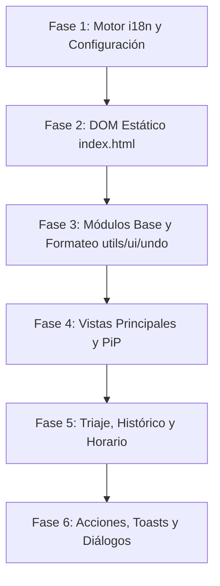

# Especificación de Internacionalización (i18n) — TodayTasks

Este documento establece la especificación técnica, decisiones arquitectónicas, modelo de datos y el plan de migración por fases para dotar a **TodayTasks** de soporte multilingüe completo (español e inglés inicialmente, extensible a futuros idiomas).

---

## 1. Visión General y Objetivos

* **Objetivo principal:** Permitir que la interfaz completa de TodayTasks (tablero, triaje, temporizadores, mini-widget PiP, histórico, notificaciones y diálogos) funcione en múltiples idiomas seleccionables por el usuario.
* **Idiomas soportados inicialmente:** Español (`es`, idioma base de referencia) e Inglés (`en`).
* **Extensibilidad:** La arquitectura debe permitir incorporar un nuevo idioma (ej. portugués, francés, alemán) añadiendo únicamente un nuevo archivo de diccionario sin reescribir la lógica de la aplicación.
* **Filosofía Vanilla:** Mantener los principios del proyecto (JavaScript Vanilla, ES Modules nativos, cero dependencias npm externas en tiempo de ejecución, sin bundlers).

---

## 2. Decisiones de Diseño Acordadas

Las siguientes decisiones fueron acordadas para guiar la implementación:

| Aspecto | Decisión Adoptada | Justificación |
|---|---|---|
| **Fallback** | **Español (`es`)** como idioma base de reserva. | Si una clave de traducción no existe en inglés o en un idioma secundario, se muestra automáticamente el texto en español, evitando errores en tiempo de ejecución o textos vacíos. |
| **Detección por defecto** | **Automática vía `navigator.language`**. | Si el navegador del usuario está configurado en español (empieza por `es`, ej: `es-ES`, `es-MX`, `es-AR`), la app arranca en `es`. En cualquier otro caso, arranca en `en`. Si el usuario selecciona explícitamente un idioma, este prevalece. |
| **Parseo de duraciones (`parseDuration`)** | **Patrones Regex por idioma activo**. | Diccionario de expresiones regulares configurable por idioma (`DURATION_PATTERNS[locale]`). Permite reconocer tanto "1h 30m" / "2 horas" en español como "1h 30m" / "2 hours" en inglés de manera limpia y ampliable. |
| **Búsqueda inteligente** | **Indexación bilingüe simultánea**. | En `getTaskSearchableText()`, se mantienen los términos de búsqueda en ambos idiomas (`hoy today`, `destacada star featured ⭐`, `semana week`, `mas adelante later`). El usuario puede buscar indistintamente en inglés o español. |
| **Carga de diccionarios** | **Estática vía ES Modules**. | `import es from './i18n/es.js'; import en from './i18n/en.js';`. Elimina llamadas fetch asíncronas adicionales y latencia de carga inicial. Si en el futuro se superan los 5 idiomas, podrá evolucionar a importación dinámica. |
| **Estrategia de entrega** | **Rollout progresivo en 6 fases**. | Minimiza riesgos de regresión, permite mantener la suite de pruebas unitarias (`npm test`) y E2E (`playwright`) en verde en cada paso, y asegura operatividad continua. |

---

## 3. Modelo de Datos y Configuración

### 3.1. Extensión del Estado Raíz (`State`)
Se añade la propiedad `language` al esquema del estado en [js/state.js](../js/state.js) y se documenta en [docs/DATA_SCHEMA.md](./DATA_SCHEMA.md):

```typescript
interface State {
  // ... propiedades existentes (activeEnv, selectedDate, themeMode, etc.)
  language: string; // Código de idioma: 'es' | 'en' (defecto calculado con detectInitialLanguage())
}
```

### 3.2. Persistencia y Sincronización
1. **LocalStorage:** Se guarda automáticamente dentro del objeto serializado bajo la clave `tablero-dia-v1`.
2. **Cloud Firestore:** Se propaga y sincroniza entre dispositivos a través de [js/cloud.js](../js/cloud.js).
3. **Selector en la UI:** Se ubica en la pestaña `#htab-config` de la barra superior, junto al selector de tema (`#themeSelect`):
   ```html
   <div class="config-row">
     <label for="languageSelect" data-i18n="config.language">Idioma:</label>
     <select id="languageSelect">
       <option value="es">Español</option>
       <option value="en">English</option>
     </select>
   </div>
   ```

---

## 4. Arquitectura del Motor de Traducción (`js/i18n.js`)

Se introduce el módulo [js/i18n.js](../js/i18n.js) y el directorio de diccionarios `js/i18n/`:

```
js/
├── i18n.js              # Motor i18n (t, tPlural, setLocale, translateDOM)
└── i18n/
    ├── es.js            # Diccionario en español (~550 claves, idioma base)
    └── en.js            # Diccionario en inglés (~550 claves)
```

### 4.1. API del Motor `i18n.js`

```javascript
import es from './i18n/es.js';
import en from './i18n/en.js';

const dictionaries = { es, en };
let currentLocale = 'es';

/**
 * Traduce una clave con soporte para interpolación de parámetros {nombre}.
 * Si la clave no existe en el idioma actual, recurre al diccionario en español.
 */
export function t(key, params = {}) { ... }

/**
 * Traduce cadenas con soporte para pluralización { one, other }.
 */
export function tPlural(key, count, params = {}) { ... }

/**
 * Devuelve el idioma activo actual.
 */
export function getLocale() { return currentLocale; }

/**
 * Cambia el idioma activo.
 */
export function setLocale(locale) { ... }

/**
 * Detección del idioma inicial del navegador.
 */
export function detectInitialLanguage() {
  const navLang = (navigator.language || '').toLowerCase();
  return navLang.startsWith('es') ? 'es' : 'en';
}

/**
 * Traduce de forma reactiva los nodos del DOM marcados con atributos declarativos.
 */
export function translateDOM(container = document) { ... }
```

### 4.2. Declaratividad en el DOM (`data-i18n`)
Para evitar reconstruir el HTML estático de [index.html](../index.html) desde JavaScript, se emplean atributos de datos:
* `data-i18n="clave"`: Traduce el `textContent` del elemento.
* `data-i18n-html="clave"`: Traduce el `innerHTML` (para textos con etiquetas como `<strong>`).
* `data-i18n-placeholder="clave"`: Traduce el atributo `placeholder`.
* `data-i18n-title="clave"`: Traduce el atributo `title` (tooltips).
* `data-i18n-aria="clave"`: Traduce el atributo `aria-label`.

### 4.3. Estructura de Diccionario
Las claves se organizan mediante notación de puntos por dominios funcionales:

```javascript
export default {
  // Acciones comunes
  'action.save': 'Guardar',
  'action.cancel': 'Cancelar',
  'action.delete': 'Eliminar',
  'action.undo': 'Deshacer',

  // Tareas
  'task.completed': 'Tarea "{title}" completada.',
  'task.count': { one: '{count} tarea', other: '{count} tareas' },

  // Calendario y Días
  'days.full': ['Domingo', 'Lunes', 'Martes', 'Miércoles', 'Jueves', 'Viernes', 'Sábado'],
  'days.short': ['', 'Lun', 'Mar', 'Mié', 'Jue', 'Vie', 'Sáb', 'Dom'],
  'days.letter': ['', 'L', 'M', 'X', 'J', 'V', 'S', 'D'], // En inglés: ['', 'M', 'T', 'W', 'T', 'F', 'S', 'S']
  'months.short': ['ene', 'feb', 'mar', 'abr', 'may', 'jun', 'jul', 'ago', 'sep', 'oct', 'nov', 'dic'],

  // ...
};
```

---

## 5. Plan de Implementación por Fases

La migración se estructura en **6 fases secuenciales e independientes**. Cada fase concluye con la suite de pruebas unitarias (`npm test`) y pruebas manuales de regresión en verde.



---

### Fase 1: Motor i18n, Diccionarios Base y Configuración
* **Objetivo:** Disponer de la infraestructura técnica sin alterar el comportamiento visual existente.
* **Alcance:**
  1. Crear [js/i18n.js](../js/i18n.js) con `t()`, `tPlural()`, `getLocale()`, `setLocale()`, `detectInitialLanguage()` y `translateDOM()`.
  2. Crear [js/i18n/es.js](../js/i18n/es.js) con las primeras claves fundamentales y [js/i18n/en.js](../js/i18n/en.js) con sus equivalentes en inglés.
  3. Extender [js/state.js](../js/state.js) para incluir `language` en `defaultState()` y en `wrapState()`.
  4. Agregar el selector `#languageSelect` en [index.html](../index.html) y enlazarlo en [js/app.js](../js/app.js) para conmutar el idioma y disparar `renderAll()`.
  5. Crear archivo de pruebas unitarias `tests/i18n.test.js`.
* **Criterio de Aceptación:** `npm test` pasa al 100%. El selector existe en Configuración, conmuta el estado y persiste en `localStorage`.

---

### Fase 2: DOM Estático (`index.html`)
* **Objetivo:** Internacionalizar todos los textos fijos de la interfaz que no se generan dinámicamente.
* **Alcance:**
  1. Incorporar atributos `data-i18n-*` a todos los elementos traducibles de [index.html](../index.html) (~85 elementos):
     - Pestañas superiores (Entorno, Tiempo, Configuración).
     - Textos de ayuda y atajos de teclado del modal `#shortcutsModal`.
     - Títulos y botones fijos de los modales (`#copyTaskModal`, `#recurringModal`, `#featuredLimitModal`).
     - Tooltips de botones fijos en la cabecera.
  2. Integrar `translateDOM()` en el ciclo de arranque de [js/app.js](../js/app.js) y tras cada cambio de idioma.
* **Criterio de Aceptación:** Al cambiar entre Español e English, toda la barra superior, la pestaña de configuración y las ventanas modales cambian de idioma de inmediato.

---

### Fase 3: Módulos Base, Fechas y Formateo
* **Objetivo:** Garantizar que los cálculos y formateos dependientes del locale funcionen en ambos idiomas.
* **Alcance:**
  1. **[js/utils.js](../js/utils.js):**
     - Nombres de días completos, abreviados y letras únicas (`L, M, X...` vs `M, T, W...`).
     - Nombres de meses.
     - Fechas amigables (`formatDateFriendly`: "Hoy" / "Today", "Mañana" / "Tomorrow", etc.).
     - Lógica de parseo `parseDuration` adaptada por idioma (`DURATION_PATTERNS`).
     - Niveles de urgencia (`URGENCY_LEVELS`: Hoy/Today, Días/Days, Semana/Week, Más adelante/Later).
     - Mapeo bilingüe en `getTaskSearchableText()`.
  2. **[js/ui.js](../js/ui.js):** Etiqueta por defecto del botón de acción en toasts ("Deshacer" / "Undo").
  3. **[js/undo.js](../js/undo.js):** Textos informativos de pila vacía y "Deshecho: X" / "Rehecho: X".
  4. **[js/cloud.js](../js/cloud.js):** Mensajes de estado de sincronización ("⏳ Guardando...", "☁ Sincronizado", "Cerrar sesión", etc.).
  5. **[js/notifications.js](../js/notifications.js):** Textos de permisos y plantillas de avisos de escritorio.
* **Criterio de Aceptación:** Fechas en cabecera y formatos de tiempo se adaptan al idioma. Búsqueda y parseo de duraciones aceptan inglés y español.

---

### Fase 4: Vistas Principales y Mini-Widget PiP
* **Objetivo:** Traducir los componentes dinámicos de uso cotidiano en el tablero y temporizador.
* **Alcance:**
  1. **[js/views/dashboard.js](../js/views/dashboard.js):** Etiquetas de estadísticas (Reuniones, Tareas por hacer, Completado hoy, Interrupciones), barra de progreso y tooltip de desviación.
  2. **[js/views/board.js](../js/views/board.js):** Timeline, títulos de colchón/descanso, fin de jornada, avisos de desbordamiento (+2h) y lista de resumen inferior.
  3. **[js/views/tasks.js](../js/views/tasks.js):** Etiquetas de estado ("en curso", "en pausa", "pendiente"), formulario inline de edición, tooltips de acción y resultados de búsqueda.
  4. **[js/views/meetings.js](../js/views/meetings.js):** Lista de reuniones y formulario inline.
  5. **[js/views/focus.js](../js/views/focus.js):** Pantalla de foco de tarea, temporizador, avisos de corte por reunión y pantalla de interrupción activa.
  6. **[js/pip.js](../js/pip.js):** Textos, tooltips y botones del visor flotante Picture-in-Picture.
* **Criterio de Aceptación:** La navegación completa por el tablero diario, el temporizador de tareas y el widget flotante se muestran 100% en el idioma elegido.

---

### Fase 5: Triaje Rápido, Histórico y Horario Semanal
* **Objetivo:** Cubrir las vistas complejas y modales de configuración avanzada.
* **Alcance:**
  1. **[js/views/triage.js](../js/views/triage.js):** Encabezados de grupos (Urgencia, Viabilidad, Duración, Destacadas), botones de ordenación, barra flotante de acciones masivas y modal de edición de triaje.
  2. **[js/app/weekly-schedule.js](../js/app/weekly-schedule.js):** Modal del horario semanal, etiquetas de día libre y validaciones horarias.
  3. **[js/history.js](../js/history.js):** Títulos de series del gráfico SVG, tarjetas de resumen de métricas y tabla de mediciones de los últimos 40 días.
* **Criterio de Aceptación:** Las vistas de triaje masivo (`#/triage`), configuración horaria y panel histórico (`#/history`) están completamente traducidas.

---

### Fase 6: Capa de Acciones, Validaciones y Diálogos
* **Objetivo:** Cerrar el ciclo traduciendo la interacción reactiva y las respuestas a eventos de negocio.
* **Alcance:**
  1. **[js/actions/tasks.js](../js/actions/tasks.js):** Validaciones (`alert`), diálogos modales de recurrencia, toasts de cambio de urgencia, límites de destacadas y eliminación.
  2. **[js/actions/meetings.js](../js/actions/meetings.js):** Validaciones y toasts de reuniones.
  3. **[js/actions/calendar.js](../js/actions/calendar.js):** Confirmaciones de día nuevo, copia/movimiento de tareas a fechas y navegación de días.
  4. **[js/actions/execution.js](../js/actions/execution.js):** Finalización de tareas, pausas e interrupciones.
  5. **[js/actions.js](../js/actions.js):** Modales de resolución de conflictos de recurrencia y destacadas.
  6. **Revisión y Calidad:** Auditoría lingüística de naturalidad en inglés y ejecución completa de suites Vitest y Playwright E2E.
* **Criterio de Aceptación:** Cero strings visibles en español al operar en modo inglés. Tests E2E adaptados o verificados con selector multilingüe.

---

## 6. Guía para Desarrolladores y Futuros Agentes

### Cómo añadir una nueva cadena traducible
1. **Nunca escribir texto visible hardcodeado** en plantillas HTML ni en asignaciones JS (`textContent`, `placeholder`, `title`).
2. Abrir [js/i18n/es.js](../js/i18n/es.js) y añadir la clave bajo el dominio correspondiente:
   ```javascript
   'task.myNewAction': 'Mi nueva acción para "{name}"',
   ```
3. Abrir [js/i18n/en.js](../js/i18n/en.js) y añadir la traducción:
   ```javascript
   'task.myNewAction': 'My new action for "{name}"',
   ```
4. En el código JavaScript, invocar mediante:
   ```javascript
   t('task.myNewAction', { name: task.title });
   ```
5. Si es en HTML estático, añadir el atributo declarativo:
   ```html
   <button data-i18n="task.myNewAction">Mi nueva acción</button>
   ```

### Cómo añadir un tercer idioma (ej. Francés `fr`)
1. Crear el archivo `js/i18n/fr.js` copiando las claves de `es.js` y traduciendo sus valores.
2. En [js/i18n.js](../js/i18n.js), importar `fr` y registrarlo en el objeto `dictionaries`:
   ```javascript
   import fr from './i18n/fr.js';
   const dictionaries = { es, en, fr };
   ```
3. Añadir la opción en el `<select id="languageSelect">` de [index.html](../index.html):
   ```html
   <option value="fr">Français</option>
   ```
4. Añadir las expresiones regulares de duración para francés en `DURATION_PATTERNS['fr']`.
