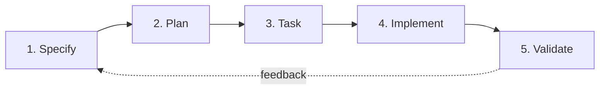
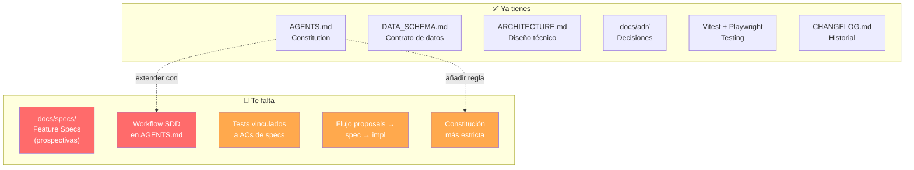

# Análisis: TodayTasks vs Spec-Driven Development

## ¿Qué es Spec-Driven Development (SDD)?

SDD es una metodología donde **la especificación es la fuente de verdad**, no el código ni el historial de chat. El ciclo es:



---

## Lo que TodayTasks YA tiene ✅

Tu proyecto está **más avanzado de lo que piensas** en varios pilares de SDD:

| Pilar SDD | Lo que ya tienes | Archivo(s) |
|---|---|---|
| **Constitution / Reglas de agente** | `AGENTS.md` con reglas, stack, versionado, testing | [AGENTS.md](file:///c:/Users/Diego_PC/Documents/GitHub/todaytasks/AGENTS.md) |
| **Esquema de datos formal** | `DATA_SCHEMA.md` con interfaces TypeScript, invariantes | [DATA_SCHEMA.md](file:///c:/Users/Diego_PC/Documents/GitHub/todaytasks/docs/DATA_SCHEMA.md) |
| **Documentación de arquitectura** | `ARCHITECTURE.md` exhaustivo (368 líneas, diagramas Mermaid) | [ARCHITECTURE.md](file:///c:/Users/Diego_PC/Documents/GitHub/todaytasks/docs/ARCHITECTURE.md) |
| **Decisiones de diseño (ADR)** | 12 ADRs bien documentados en `docs/adr/` | [docs/adr/](file:///c:/Users/Diego_PC/Documents/GitHub/todaytasks/docs/adr) |
| **Catálogo de funcionalidades** | `FEATURES.md` + `IMPROVEMENT_IDEAS.md` | [docs/features/](file:///c:/Users/Diego_PC/Documents/GitHub/todaytasks/docs/features) |
| **Changelog** | Registro de cambios por versión | [CHANGELOG.md](file:///c:/Users/Diego_PC/Documents/GitHub/todaytasks/CHANGELOG.md) |
| **Testing TDD** | Vitest + Playwright, regla de "test antes del fix" | [AGENTS.md §3](file:///c:/Users/Diego_PC/Documents/GitHub/todaytasks/AGENTS.md#L36) |
| **Versionado automático** | `version.json` + `index.html` sincronizados | [AGENTS.md §2](file:///c:/Users/Diego_PC/Documents/GitHub/todaytasks/AGENTS.md#L27) |

> [!TIP]
> Tienes una base excelente. Lo que te falta es **formalizar el flujo de trabajo** y añadir unas pocas piezas clave.

---

## Lo que FALTA para un SDD completo 🔴

### 1. 📋 Feature Specs formales (`docs/specs/`)

**Qué es:** Un directorio de especificaciones por funcionalidad, **escritas ANTES de implementar**, que definen:
- User stories y criterios de aceptación
- Flujo de usuario paso a paso
- Restricciones (rendimiento, accesibilidad, navegadores)
- Mockups o wireframes (si aplica)
- Dependencias con otros módulos

**Por qué falta:** Tu `FEATURES.md` es un **catálogo retroactivo** (documenta lo ya construido). SDD requiere specs **prospectivas** que sirvan de contrato entre tú y el agente IA.

**Ejemplo de estructura:**
```
docs/specs/
├── template.md              # Plantilla estándar para nuevas specs
├── 013-filtro-por-tags.md   # Spec de una funcionalidad futura
├── 014-modo-pomodoro.md
└── ...
```

**Ejemplo de contenido (`template.md`):**
```markdown
# [Nombre de la funcionalidad]
Versión: draft | approved | implemented
Fecha: YYYY-MM-DD

## Problema / Contexto
¿Qué problema resuelve?

## User Stories
- Como [rol], quiero [acción], para [beneficio].

## Criterios de Aceptación
- [ ] Dado [contexto], cuando [acción], entonces [resultado].
- [ ] ...

## Diseño Técnico (alto nivel)
- Módulos afectados: ...
- Cambios en DATA_SCHEMA: ...

## Restricciones
- Performance: ...
- Accesibilidad: ...

## Fuera de Alcance
- ...
```

---

### 2. 🔄 Ciclo de vida de la spec (Workflow formalizado)

**Qué es:** Un flujo documentado que define **cuándo** se escribe la spec, **quién** la aprueba, y **cuándo** se puede empezar a codificar.

**Qué falta en tu `AGENTS.md`:** Tu regla §4.1 dice *"Si es un cambio importante, plantea un plan de implementación"*, pero no hay:
- Un paso obligatorio de **escribir la spec** antes del plan
- Un estado de **aprobación** explícito
- Un paso de **validación** post-implementación contra la spec

**Propuesta de flujo para añadir a `AGENTS.md`:**
```
1. SPECIFY → Escribir spec en docs/specs/NNN-nombre.md
2. REVIEW  → El usuario revisa y aprueba la spec
3. PLAN    → Crear plan de implementación (implementation_plan.md)
4. TASK    → Descomponer en tareas granulares
5. BUILD   → Implementar + tests unitarios
6. VALIDATE → Verificar cada criterio de aceptación de la spec
```

---

### 3. 🧪 Tests vinculados a specs (Traceability)

**Qué es:** Cada criterio de aceptación de una spec debe tener un test asociado que lo valide. Actualmente tus tests validan lógica interna, pero no están **explícitamente vinculados** a requisitos formales.

**Qué falta:**
- Convención de nombrado como `013-filtro-por-tags.spec.js` que vincule test ↔ spec
- Comentarios en los tests que referencien el criterio de aceptación (`// AC-1: Dado que...`)
- Un paso de validación que recorra todos los ACs de la spec y confirme que hay tests que los cubren

---

### 4. 📄 Propuestas formalizadas (`docs/proposals/`)

**Qué es:** Tu directorio `docs/proposals/` existe pero está **vacío**. Debería usarse como inbox de ideas que pasan por el flujo:

```
Idea → Proposal (borrador) → Spec (aprobada) → ADR (decisión de diseño) → Implementación
```

Actualmente las ideas van a `IMPROVEMENT_IDEAS.md` pero no hay un proceso formal para "promover" una idea a spec.

---

### 5. 🔒 Constitución más estricta

**Qué es:** Una `constitution.md` o una sección en `AGENTS.md` que defina reglas **no-negociables** más allá de lo operativo. Ejemplos:

- *"Ninguna funcionalidad nueva se implementa sin una spec aprobada en `docs/specs/`"*
- *"Todo cambio en `DATA_SCHEMA.md` requiere un ADR"*
- *"Los tests de criterios de aceptación deben pasar antes de marcar la spec como `implemented`"*

---

## Resumen visual del gap



---

## 🔗 Recursos y URLs recomendadas

### Frameworks SDD completos

| Recurso | URL | Para qué |
|---|---|---|
| **BMAD-METHOD** (GitHub) | https://github.com/bmad-code-org/BMAD-METHOD | Framework completo con agentes especializados (PM, Architect, Dev, QA). El más robusto para SDD agéntico |
| **Spec Kit (GitHub)** | https://github.com/github/spec | CLI oficial de GitHub para SDD. Trata las specs como ciudadanos de primera clase en el repo |
| **AWS Kiro** | https://kiro.dev/ | IDE con "Spec Mode" integrado para formalizar requisitos |

### Artículos y guías

| Recurso | URL | Para qué |
|---|---|---|
| **"Spec-Driven Development: A complete guide"** | https://glukhov.org | Guía paso a paso del ciclo completo Specify → Plan → Task → Implement → Validate |
| **"From Vibe Coding to Spec-Driven Dev"** (DEV.to) | https://dev.to/tags/specdriven | Artículos de la comunidad sobre la transición de vibe coding a SDD |
| **"Spec-First API Development"** (Allegro Tech) | https://allegro.tech | Enfoque spec-first aplicado a APIs, principios trasladables a frontend |
| **BMAD Method Docs** | https://bmad-method.org | Documentación oficial del método BMAD |
| **"Intent-Driven Development"** | https://intent-driven.dev | Variante de SDD centrada en la intención del usuario |
| **CodeMySpec** | https://codemyspec.com | Plataforma y guías sobre cómo escribir specs efectivas para agentes IA |

### Sobre ADRs y constituciones

| Recurso | URL | Para qué |
|---|---|---|
| **ADR en GitHub** | https://adr.github.io | Estándar de Architecture Decision Records |
| **Martin Fowler - Architecture Decisions** | https://martinfowler.com/articles/scaling-architecture-conversationally.html | Contexto teórico sobre decisiones de arquitectura |

---

## Próximos pasos sugeridos (por orden de impacto)

1. **Crear `docs/specs/template.md`** — Plantilla estándar de feature spec
2. **Añadir el workflow SDD a `AGENTS.md` §4** — Formalizar el flujo Specify → Plan → Build → Validate
3. **Migrar `docs/proposals/` a inbox activo** — Definir el flujo idea → proposal → spec
4. **Para la próxima funcionalidad:** escribir la spec primero y usarla como contrato
5. **Gradualmente vincular tests existentes a specs retroactivas** (no urgente)

> [!IMPORTANT]
> No necesitas adoptar un framework externo como BMAD si no quieres. Tu setup ya tiene los cimientos. Lo principal es **añadir el paso de especificación prospectiva** y **formalizar el flujo en AGENTS.md**.
